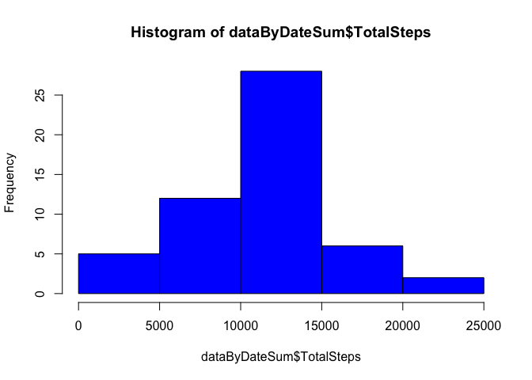

# Reproducible Research: Peer Assessment 1
## Load the necessary libraries

```r
library(dplyr)
```

```
## 
## Attaching package: 'dplyr'
## 
## The following object is masked from 'package:stats':
## 
##     filter
## 
## The following objects are masked from 'package:base':
## 
##     intersect, setdiff, setequal, union
```

```r
library(lubridate)
```

```
## Warning: package 'lubridate' was built under R version 3.1.2
```

```r
library(stringr)
library(lattice)
```

```
## Warning: package 'lattice' was built under R version 3.1.2
```

## Loading and preprocessing the data

```r
unzip("activity.zip")
data <- read.csv("activity.csv",colClasses=c(NA,"Date",NA),col.names=c("Steps","Date","Interval"))
# Reorder the columns
data <- select(data,Date,Interval,Steps)
```

## What is mean total number of steps taken per day?

```r
# Calculate the number of steps taken per day using the dplyr package
dataByDate <- group_by(data,Date)
dataByDateSum <- dataByDate %>%
                        filter(!Steps %in% NA) %>%
                        summarize(TotalSteps=sum(Steps))
# Create a histogram for the total number of steps per day
hist(dataByDateSum$TotalSteps)
```

 

```r
# Calculate the mean and median of the total number of steps per day
mean(dataByDateSum$TotalSteps)
```

```
## [1] 10766.19
```

```r
median(dataByDateSum$TotalSteps)
```

```
## [1] 10765
```

## What is the average daily activity pattern?

```r
# Make a time series plot (i.e. type = "l") of the 5-minute interval (x-axis) and the average number of steps taken, averaged across all days (y-axis)
# Calculate the mean number of steps per interval
dataByInt <- group_by(data,Interval)
dataByIntMean <- dataByInt %>%
                            filter(!Steps %in% NA) %>%
                            summarize(TotalSteps=mean(Steps))
# Convert Interval into a date format
intervalDate <- strptime(sprintf("%04d", as.numeric(dataByIntMean$Interval)), format="%H%M")
dataByIntMean <- cbind(dataByIntMean,intervalDate)

# Create the plot
plot (dataByIntMean$intervalDate,dataByIntMean$TotalSteps, typ="l",xlab = "Time of Day (HH:MM)",ylab = "Mean Number of Steps")
```

 

```r
# Determine which 5-minute interval, on average across all the days in the dataset, contains the maximum number of steps?
dataByIntMean[(dataByIntMean$TotalSteps == max(dataByIntMean$TotalSteps)),]
```

```
##     Interval TotalSteps        intervalDate
## 104      835   206.1698 2015-03-15 08:35:00
```

## Imputing missing values

```r
# Check for NAs in the entire data DF.
sum(is.na(data))
```

```
## [1] 2304
```

```r
# Check for NAs in the Steps variable.
sum(is.na(data$Steps))
```

```
## [1] 2304
```

```r
# Since out latter output equals check on entire DF then NAs only exist in Steps variable

## Strategy to for filling in NA values
# Create a copy of the original data DF that was read in
dataNew <- data
# Create a logical vector on dataByInt$Steps showing location of NAs
missingSteps <- is.na(dataNew$Steps)
# Create a vector containing mean steps minus NAs
meanSteps <- dataByIntMean[,2]
# Add the interval names to the new vector
names(meanSteps) <- dataByIntMean[,1]
# Round the mean values in meanSteps and overwrite the missing values in the data DF.  Create a new dataset.
dataNew[missingSteps,3] <- round(meanSteps[as.numeric(names(meanSteps)) %in% data[missingSteps,2]])

# Calculate the number of steps taken per day (reuse code from above)
dataNewByDate <- group_by(dataNew,Date)
dataNewByDateSum <- dataNewByDate %>%
    filter(!Steps %in% NA) %>%
    summarize(TotalSteps=sum(Steps))
# Create a histogram for the total number of steps per day
hist(dataNewByDateSum$TotalSteps)
```

 

```r
# Calculate the mean and median of the total number of steps per day
mean(dataNewByDateSum$TotalSteps)
```

```
## [1] 10765.64
```

```r
median(dataNewByDateSum$TotalSteps)
```

```
## [1] 10762
```

## Are there differences in activity patterns between weekdays and weekends?
